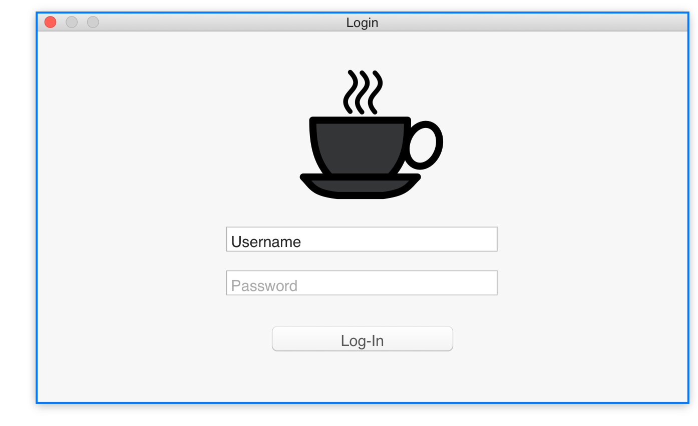
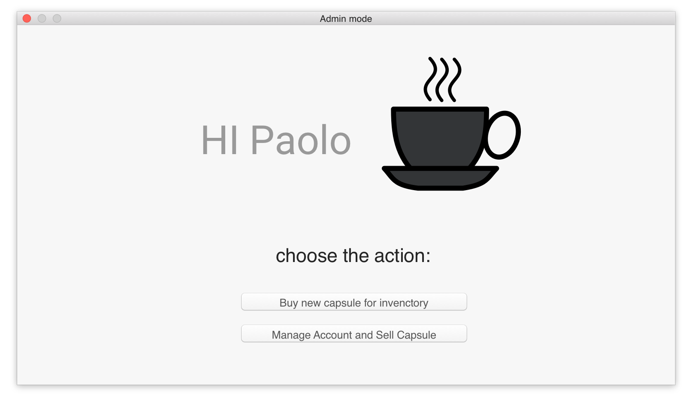
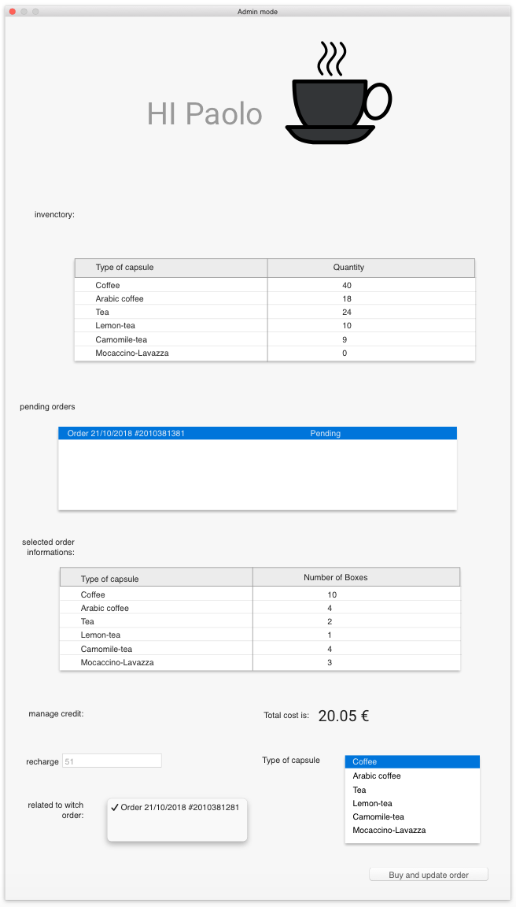
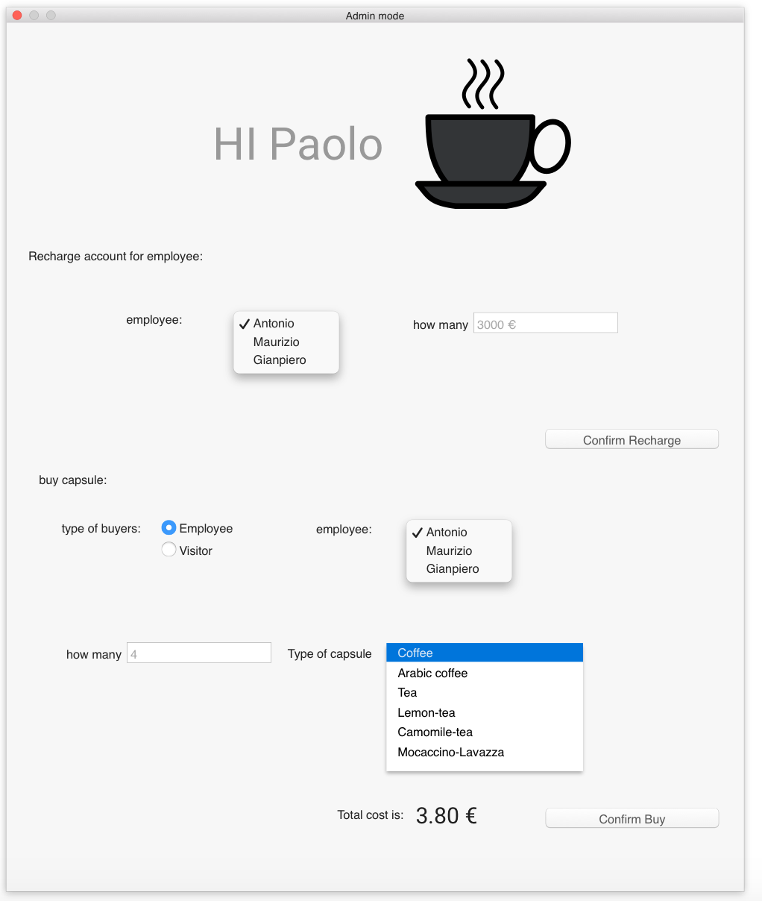
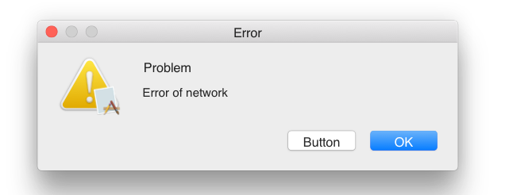
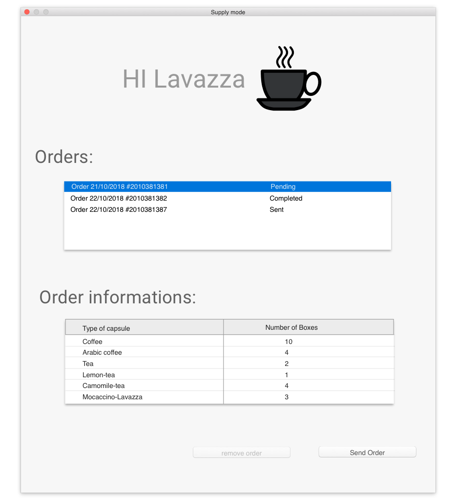
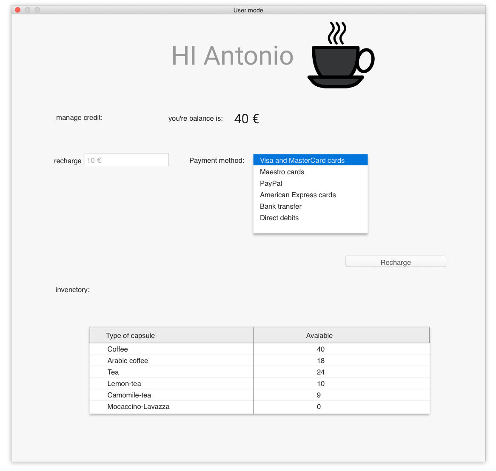

# UI of project

## the login ui

this is the UI where the user insert the credential and after is redirected to
the next page depending on his credential.

## the administrative's pages

#### action page

the first administrative page, it ask to the manager witch action want to do.

#### invectory page

this page allow the administrator to inseert orders for new capsules

#### account amministrator page

this page is for managing the credit of the employee and manage the sell of the
capsule and boxes

#### types of error:

error retrived when a user has not enought credit for buy with credit the
coffee

error retrived when the software cannot correct connect itself to the webapi
necessary for the actions

## the Supply page

an example of page of supply that can delete,see or sent a request of order

## the user page

the page that the user see when login, it contains the invenctory and the
options for reload the credit.
