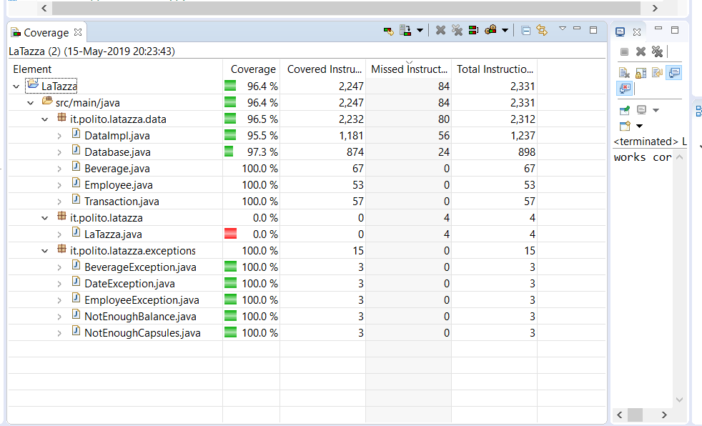

# Unit Testing Documentation template

Authors: 
- Elia migliore s267552
- Ndjekoua sandjo jean thibaut s256770
- Roy Paulin Justo Nguetsop Kenfack Djouaka s257855

Date:    15705/2019

Version: final

# Contents

- [Black Box Unit Tests](#black-box-unit-tests)

- [White Box Unit Tests](#white-box-unit-tests)

# Black Box Unit Tests

 ### **Class *TestDatabase.java* - method testDatabaseTruncate**

**Criteria for method truncateTables:**

 - exception does not occure

**Predicates for method *truncateTables*:**

| Criteria | Predicate |
| -------- | --------- |
|     exception does not occure     |        yes   |
|          |     no      |

 ### **Class *TestDatabase.java* - method testDatabaseAddEmployee**

**Criteria for method addEmployee:**

 - id is correct

**Predicates for method *addEmployee*:**

| Criteria | Predicate |
| -------- | --------- |
|     id is correct     |        yes   |
|          |     no      |

 ### **Class *TestDatabase.java* - method testDatabaseGetEmployee**

**Criteria for method getListEmployee:**

 - list is full

**Predicates for method *getListEmployee*:**

| Criteria | Predicate |
| -------- | --------- |
|     list is full     |        yes   |
|          |     no      |

 ### **Class *TestDatabase.java* - method testDatabaseUpdateBalance**

**Criteria for method updateBalance:**

 - balance is correct

**Predicates for method *updateBalance*:**

| Criteria | Predicate |
| -------- | --------- |
|     balance is correct     |        yes   |
|          |     no      |

 ### **Class *TestDatabase.java* - method testDatabaseAddBeverage**

**Criteria for method addBeverage:**

 - id is correct

**Predicates for method *addBeverage*:**

| Criteria | Predicate |
| -------- | --------- |
|     id is correct     |        yes   |
|          |     no      |

 ### **Class *TestDatabase.java* - method testDatabaseGetBeverage**

**Criteria for method getBeverage:**

 - beverage is correct

**Predicates for method *getBeverage*:**

| Criteria | Predicate |
| -------- | --------- |
|     beverage is correct     |        yes   |
|          |     no      |

 ### **Class *TestDatabase.java* - method testDatabaseGetListBeverage**

**Criteria for method getListBeverage:**

 - list is full

**Predicates for method *getListBeverage*:**

| Criteria | Predicate |
| -------- | --------- |
|     list is full     |        yes   |
|          |     no      |

 ### **Class *TestDatabase.java* - method testDatabaseAddTransaction**

**Criteria for method AddTransaction:**

 - id is correct

**Predicates for method *AddTransaction*:**

| Criteria | Predicate |
| -------- | --------- |
|     id is correct     |        yes   |
|          |     no      |

 ### **Class *TestDatabase.java* - method testDatabaseUpdateBeverage**

**Criteria for method updateBeverage:**

 - beverage is correct

**Predicates for method *AddTransaction*:**

| Criteria | Predicate |
| -------- | --------- |
|     beverage is correct     |        yes   |
|          |     no      |

### **Class *TestDatabase.java* - method testDatabaseUpdateEmployee**

**Criteria for method updateEmployee:**

 - employee is correct

**Predicates for method *updateEmployee*:**

| Criteria | Predicate |
| -------- | --------- |
|     employee is correct     |        yes   |
|          |     no      |

### **Class *TestDatabase.java* - method testDatabaseGetEmployeeRecord**

**Criteria for method getEmployeeReport:**

 - list of transaction is correct

**Predicates for method *getEmployeeReport*:**

| Criteria | Predicate |
| -------- | --------- |
|     list of transaction is correct     |        yes   |
|          |     no      |

### **Class *TestDatabase.java* - method testDatabaseGetListOfTransactions**

**Criteria for method getListOfTransactions:**

 - list of transaction is correct

**Predicates for method *getEmployeeReport*:**

| Criteria | Predicate |
| -------- | --------- |
|     list of transaction is correct     |        yes   |
|          |     no      |

 ### **Class *DataImpl.java* - method getBeverageCapsules**

**Criteria for method getBeverageCapsules:**

 - id is valid

**Predicates for method *getBeveragesCapsules*:**

| Criteria | Predicate |
| -------- | --------- |
|     id is valid     |        yes   |
|          |     no      |

 ### **Class *DataImpl.java* - method getBeverages**

**Criteria for method getBeverages:**

 - return value is correct

**Predicates for method *getBeverages*:**

| Criteria | Predicate |
| -------- | --------- |
|     return value is correct     |        yes   |
|          |     no      |

**Boundaries**:

| Criteria | Boundary values |
| -------- | --------------- |
|     return value     |          empty map      |

 ### **Class *DataImpl.java* - method getBeveragesId**

**Criteria for method getBeverages:**

 - return value is correct

**Predicates for method *getBeverages*:**

| Criteria | Predicate |
| -------- | --------- |
|     return v
alue is correct     |        yes   |
|          |     no      |

**Boundaries**:

| Criteria | Boundary values |
| -------- | --------------- |
|     return value     |          empty List      |

 ### **Class *DataImpl.java* - method getBeverageBoxPrice**

**Criteria for method getBeverageBoxPrice:**

 - id is correct

**Predicates for method *getBeverageBoxPrice*:**

| Criteria | Predicate |
| -------- | --------- |
|     id is correct     |        yes   |
|          |     no      |

 ### **Class *DataImpl.java* - method getBeverageCapsulesPerBox**

**Criteria for method getBeverageCapsulesPerbox:**

 - id is correct

**Predicates for method *getBeverageCapsulesPerBox*:**

| Criteria | Predicate |
| -------- | --------- |
|     id is correct     |        yes   |
|          |     no      |

 ### **Class *DataImpl.java* - method getBeverageName**

**Criteria for method getBeverageName:**

 - id is correct

**Predicates for method *getBeverageName*:**

| Criteria | Predicate |
| -------- | --------- |
|     id is correct     |        yes   |
|          |     no      |

 ### **Class *DataImpl.java* - method updateBeverage**

**Criteria for method updateBeverage:**

 - id is valid
 - range of capsulesPerbox
 - range of boxPrice

**Predicates for method *updateBeverage*:**

| Criteria | Predicate |
| -------- | --------- |
|     id is valid     |        yes   |
|          |     no      |
|   range of capsulesPerbox     |   >0        |
|          |        <0  |
| range of boxPrice        |    >0       |
|          |    <0       |

**Boundaries**:

| Criteria | Boundary values |
| -------- | --------------- |
|     range of capsulesPerBox     |         minint,0,maxint        |
|     range of boxPrice     |      minint,0,maxint           |

**Combination of predicates**:

| id is valid | range of CapsulesPerBox | range of boxPrice | Valid / Invalid | Description of the test case | JUnit test case |
|-------|-------|-------|-------|-------|-------|
|yes|>0|>0|Valid|everything is good so the beverage should be updated|testUpdateBeverageWithSuccess|
|yes|>0|<0|Invalid|The beverage should not be updated|testUpdateBeverageWrongAttributes|
|yes|<0|>0|Invalid|The beverage should not be unpdated|testUpdateBeverageWrongAttributes|
|yes|<0|<0|Invalid|The beverage should not be testUpdated|updateBeverageWrongAttributes|
|no|>0|>0|Invalid| the beverage should not be updated|testUpdateBeverageWrongId|
|no|>0|<0|Invalid|The beverage should not be updated|testUpdateBeverageWrongId|
|no|<0|>0|Invalid|The beverage should not be unpdated|testUpdateBeverageWrongId|
|no|>0|<0|Invalid|The beverage should not be updated|testUpdateBeverageWrongId|

 ### **Class *DataImpl.java* - method createBeverage**

**Criteria for method createBeverage:**

 - range of capsulesPerbox
 - range of boxPrice

**Predicates for method *createBeverage*:**

| Criteria | Predicate |
| -------- | --------- |
|   range of capsulesPerbox     |   >0        |
|          |        <0  |
| range of boxPrice        |    >0       |
|          |    <0       |

**Boundaries**:

| Criteria | Boundary values |
| -------- | --------------- |
|     range of capsulesPerBox     |         minint,0,maxint        |
|     range of boxPrice     |      minint,0,maxint           |

**Combination of predicates**:

| range of CapsulesPerBox | range of boxPrice | Valid / Invalid | Description of the test case | JUnit test case |
|-------|-------|-------|-------|-------|
|>0|>0|Valid|everything is good so the beverage should be created|testCreateBeverage|
|>0|<0|Invalid|The beverage should not be created|testCreateBeverageWrongAttributes|
|<0|>0|Invalid|The beverage should not be created|testCreateBeverageWrongAttributes|
|<0|<0|Invalid|The beverage should not be created|testCreateBeverageWrongAttributes|

 ### **Class *DataImpl.java* - method getReport**

**Criteria for method getReport:**

 - startDate is valid
 - endDate is valid
 - startDate < endDate ?

**Predicates for method *getReport*:**

| Criteria | Predicate |
| -------- | --------- |
|   startDate is valid     |   yes        |
|          |        no  |
| endDate is valid       |    yes       |
|          |    no       |
|    startDate < endDate ?     |       yes        |
|          |          no     |

**Combination of predicates**:

| startDate is valid | endDate is valid | startDate < endDate | Valid / Invalid | Description of the test case | JUnit test case |
|-------|-------|-------|-------|-------|-------|
|yes|yes|yes|Valid|everything is good|tesgetReport|
|yes|yes|no|Invalid|we should throw a DateException|testGetReportWrongDate|
|yes|no|yes|Invalid|we should throw a DateException|testGetReportNullDate|
|yes|no|no|Invalid|we should throw a DateException|testGetReportNullDate|
|no|yes|no|Invalid|we should throw a DateException|testGetReportNullDate|
|no|yes|yes|Invalid|we should throw a DateException|testGetReportNullDate|
|no|no|no|Invalid|we should throw a DateException|testGetReportNullDate|
|no|no|yes|Invalid|we should throw a DateException|testGetReportNullDate|

 ### **Class *DataImpl.java* - method getEmployeeReport**

**Criteria for method getEmployeeReport:**

 - startDate is valid
 - endDate is valid
 - startDate < endDate ?
 - employeeId is valid

**Predicates for method *getReport*:**

| Criteria | Predicate |
| -------- | --------- |
|   startDate is valid     |   yes        |
|          |        no  |
| endDate is valid       |    yes       |
|          |    no       |
|    startDate < endDate ?     |       yes        |
|          |          no     |
|employeeId is valid|yes|
||no|

**Combination of predicates**:

|employeeId is valid| startDate is valid | endDate is valid | startDate < endDate | Valid / Invalid | Description of the test case | JUnit test case |
|-------|-------|-------|-------|-------|-------|-------|
|yes|yes|yes|yes|Valid|everything is good|tesgetReportEmployee|
|yes|yes|yes|no|Invalid|we should throw a DateException|testGetEmployeeReportWrongDate|
|yes|yes|no|yes|Invalid|we should throw a DateException|testGetEmployeeReportNullDate|
|yes|yes|no|no|Invalid|we should throw a DateException|testEmployeeGetReportNullDate|
|yes|no|yes|no|Invalid|we should throw a DateException|testGetEmployeeReportNullDate|
|yes|no|yes|yes|Invalid|we should throw a DateException|testGetEmployeeReportNullDate|
|yes|no|no|no|Invalid|we should throw a DateException|testGetEmployeeReportNullDate|
|yes|no|no|yes|Invalid|we should throw a DateException|testGetEmployeeReportNullDate|
|no|yes|yes|yes|Valid|we should throw an employee exception|tesgetReportEmployeeWrongEmployee|
|no|yes|yes|no|Invalid|we should throw a DateException|testGetEmployeeReportWrongDate|
|no|yes|no|yes|Invalid|we should throw a DateException|testGetEmployeeReportNullDate|
|no|yes|no|no|Invalid|we should throw a DateException|testEmployeeGetReportNullDate|
|no|no|yes|no|Invalid|we should throw a DateException|testGetEmployeeReportNullDate|
|no|no|yes|yes|Invalid|we should throw a DateException|testGetEmployeeReportNullDate|
|no|no|no|no|Invalid|we should throw a DateException|testGetEmployeeReportNullDate|
|no|no|no|yes|Invalid|we should throw a DateException|testGetEmployeeReportNullDate|

 ### **Class *DataImpl.java* - method buyBoxes**

**Criteria for method buyBoxes:**

 - beverageId is valid
 - balance is enough for boxQuantity

**Predicates for method *createBeverage*:**

| Criteria | Predicate |
| -------- | --------- |
|    beverageId is valid     |  yes       |
|          |        no  |
|balance is enough for boxQuantity        |    yes      |
|          |    no       |

**Boundaries**:

| Criteria | Boundary values |
| -------- | --------------- |
|   balance is enough for boxQuantity    |         minint,0,maxint        |

**Combination of predicates**:

| beverageId is valid  | balance is enough for boxQuantity   | Valid / Invalid | Description of the test case | JUnit test case |
|-------|-------|-------|-------|-------|
|yes|yes|Valid|everything is good so thepurchase is completed with success|testBuyBoxesSuccess|
|yes|no|Invalid|we should a NotEnoughBalance exception|testBuyBoxesNotEnoughBalance|
|no|yes|Invalid|we should throw a BeverageException|testBuyBoxesWrongBeverageId
|no|no|Invalid|We should throw a new BeverageException|testBuyBoxesWrongBeverageId

 ### **Class *DataImpl.java* - method getEmployeeName**

**Criteria for method getEmployeeName:**

 - id is correct

**Predicates for method *getEmployeeName*:**

| Criteria | Predicate |
| -------- | --------- |
|     id is correct     |        yes   |
|          |     no      |

 ### **Class *DataImpl.java* - method getEmployeeSurname**

**Criteria for method getEmployeeSurname:**

 - id is correct

**Predicates for method *getEmployeeSurname*:**

| Criteria | Predicate |
| -------- | --------- |
|     id is correct     |        yes   |
|          |     no      |

 ### **Class *DataImpl.java* - method getEmployeeBalance**

**Criteria for method getEmployeeBalance:**

 - id is correct

**Predicates for method *getEmployeeBalance*:**

| Criteria | Predicate |
| -------- | --------- |
|     id is correct     |        yes   |
|          |     no      |

 ### **Class *DataImpl.java* - method getEmployees**

**Criteria for method getEmployees:**

 - return value is correct

**Predicates for method *getEmployees*:**

| Criteria | Predicate |
| -------- | --------- |
|     return value is correct     |        yes   |
|          |     no      |

**Boundaries**:

| Criteria | Boundary values |
| -------- | --------------- |
|     return value     |          empty map      |

### **Class *DataImpl.java* - method getEmployeesId**

**Criteria for method getEmployeesId:**

 - return value is correct

**Predicates for method *getEmployeesId*:**

| Criteria | Predicate |
| -------- | --------- |
|     return value is correct     |        yes   |
|          |     no      |

**Boundaries**:

| Criteria | Boundary values |
| -------- | --------------- |
|     return value     |          empty list      |

 ### **Class *DataImpl.java* - method updateEmployee**

**Criteria for method updateEmployee:**

 - id is valid
 - name is empty or null
 - surname is empty or null

**Predicates for method *updateEmployee*:**

| Criteria | Predicate |
| -------- | --------- |
|     id is valid     |        yes   |
|          |     no      |
|   name is empty or null     |   yes        |
|          |        no  |
| surname is empty or null       |    yes      |
|          |    no       |

**Combination of predicates**:

| id is valid | name is empty or null | surname is empty or null | Valid / Invalid | Description of the test case | JUnit test case |
|-------|-------|-------|-------|-------|-------|
|yes|yes|yes|invalid|the employee should not be updated|testUpdateEmployeeMissingParameters|
|yes|yes|no|invalid|The employee should not be updated|testUpdateEmployeeMissinParameters|
|yes|no|yes|invalid|The employee should  not be updated|testUpdateEmployeeMissingParameters|
|yes|no|no|valid|The employee should be updated|testUpdateEmployee|
|no|yes|yes|Invalid| the employee should not be updated|testUpdateEmployeeWrongId|
|no|yes|no|Invalid|The employee should not be updated|testUpdateEmployeeWrongId|
|no|no|yes|Invalid|The employee should not be unpdated|testUpdateEmployeeWrongId|
|no|no|no|Invalid|The employee should not be updated|testUpdateEmployeeWrongId|

 ### **Class *DataImpl.java* - method createEmployee**

**Criteria for method createEmployee:**

 - name is empty or null
 - surname is empty or null

**Predicates for method *createEmployee*:**

| Criteria | Predicate |
| -------- | --------- |
|   name is empty or null    |   yes       |
|          |        no  |
| surname is empty or null        |    yes       |
|          |    no      |

**Combination of predicates**:

| name is empty or null | surname is empty or null | Valid / Invalid | Description of the test case | JUnit test case |
|-------|-------|-------|-------|-------|
|yes|yes|invalid|the employee should not  be created|testCreateEmployeeMissingParameters|
|yes|no|Invalid|The employee should not be created|testCreateEmployeeMissingParameters|
|no|yes|Invalid|The employee should not be created|testCreateEmployeeMissingParameters|
|no|no|valid|The employee should be created|testCreateEmployee|

###**Class *DataImpl.java* - method sellCapsules**
**Criteria for method sellCapsules:**

- Employee id is valid
- Beverage id is valid
- range of numberOfCapsules
- pay from account
- range of account

**Predicates for method *sellCapsules*:**

| Criteria | Predicate |
| -------- | --------- |
|   Employee id is valid    |   yes       |
|          |        no  |
| Beverage id is valid        |    yes       |
|          |    no      |
|     range of numberOfcapsules     |    > numberOfAvailableCapsules      |
|        |  0<... < numberOfAvailableCapsules      |
|        |    < 0     |
|     pay from account     |  yes         |
|         |  no         |
|     range of  amountToPay     |   <account         |
|         |  >account        |

**Boundaries**:

| Criteria | Boundary values |
| -------- | --------------- |
|     range of numberOfcapsules    |   minint,0,numberOfAvailableCapsules,maxint             |
|     range of amountTopay     |      0,account,maxint           |

**Combination of predicates**:

|employeeId is valid| beverageid is valid | pay from account | range of numberOfCapsules | range of amountToPay |Valid / Invalid | Description of the test case | JUnit test case |
|-------|-------|-------|-------|-------|-------|-------|-------|
|yes|yes|yes|0<…<numberOfAvailableCapsules|  <account  |Valid|everything is ok|testSellCapsules|
|yes|yes|yes|0<…<numberOfAvailableCapsules|  >account  |invalid|we should throw an EmployeeException|testSellCapsulesNotEnoughMoney|
|yes|yes|no|0<…<numberOfAvailableCapsules|  |valid|everything is ok|testSellCapsules|
|yes|yes|yes|>numberOfAvailableCapsules|    |invalid|we should throw a NotEnoughCapsules Exception|testSellCapsulesNotEnoughCapsules|
|yes|yes|no|>numberOfAvailableCapsules|    |invalid|we should throw a NotEnoughCapsules Exception|testSellCapsulesNotEnoughCapsules|
|yes|yes|yes|<0|    |invalid|the operation should be aborted|testSellCapsulesWrongAttributes|
|yes|yes|no|<0|    |invalid|the operation should be aborted|testSellCapsulesWrongAttributes|
|yes|no|for any value|for any value| for any value   |invalid|we should throw a BeverageException |testSellCapsulesWrongAttributes|
|no|yes|for any value|for any value| for any value   |invalid|we should throw n EmployeeException |testSellCapsulesWrongAttributes|
|no|no|for any value|for any value| for any value   |invalid|we should throw a BeverageException  and a EmployeeException|testSellCapsulesWrongAttributes|

###**Class *DataImpl.java* - method sellCapsulesToVisitor**
**Criteria for method sellCapsulesToVisitor:**

- Beverage id is valid
- range of numberOfCapsules

**Predicates for method *sellCapsulesToVisitor*:**

| Criteria | Predicate |
| -------- | --------- |
| Beverage id is valid        |    yes       |
|          |    no      |
|     range of numberOfcapsules     |    > numberOfAvailableCapsules      |
|        |  0<... < numberOfAvailableCapsules      |
|        |    < 0     |

**Boundaries**:

| Criteria | Boundary values |
| -------- | --------------- |
|     range of numberOfcapsules    |   minint,0,numberOfAvailableCapsules,maxint             |

|beverageid is valid | range of numberOfCapsules | Valid / Invalid | Description of the test case | JUnit test case |
|-------|-------|-------|-------|-------|
|yes|0<…<numberOfAvailableCapsules| Valid|everything is ok|testSellCapsulesToVisitor|
|yes|>numberOfAvailableCapsules| invalid|We should throw a NotEnoughCapsulesException |testSellCapsulesToVisitorNotEnoughCapsules|
|yes|<0| invalid|the operation should be aborted|testSellCapsulesToVisitorWrongAttributes|
|no|0<…<numberOfAvailableCapsules| invalid|we should throw a BeverageException |testSellCapsulesToVisitorWrongAttributes|
|no|<0| invalid|we should throw a BeverageException |testSellCapsulesToVisitorWrongAttributes|
|no|>numberOfAvailableCapsules| invalid|we should throw a BeverageException |testSellCapsulesToVisitorWrongAttributes|

###**Class *DataImpl.java* - method rechargeAccount**
**Criteria for method rechargeAccount:**

- Employee id is valid
- range of amountInCents

**Predicates for method *rechargeAccount*:**

| Criteria | Predicate |
| -------- | --------- |
| Employee  id is valid        |    yes       |
|          |    no      |
|    range of amountInCents       |    >0     |
|          |    <0     |

**Boundaries**:

| Criteria | Boundary values |
| -------- | --------------- |
|     range of amounInCents    |   minint,0,maxint             |

|Employeeid is valid | range of amountInCents | Valid / Invalid | Description of the test case | JUnit test case |
|-------|-------|-------|-------|-------|
|yes|>0| Valid|everything is ok|testRechargeAccount|
|yes|<0| invalid|the operation should be aborted|testRechargeAccountWrongAttributes|
|no|>0| invalid|we should throw EmployeeException|testRechargeAccountWrongAttributes|
|no|<0| invalid|we should throw EmployeeException|testRechargeAccountWrongAttributes|

# White Box Unit Tests

### Test cases definition

    <Report here all the created JUnit test cases, and the units/classes they test >

| Unit name | JUnit test case |
|--|--|
|TestDatabase|testDatabaseTruncate|
|TestDatabase|testDatabaseAddEmployee|
|TestDatabase|testDatabaseGetEmployee|
|TestDatabase|testDatabaseUpdateBalance|
|TestDatabase|testDatabaseAddBeverage|
|TestDatabase|testDatabaseGetBeverage|
|TestDatabase|testDatabaseGetBeverage|
|TestDatabase|testDatabaseAddTransaction|
|TestDatabase|testDatabaseupdateVeverage|
|TestDatabase|testDatabaseUpdateEmployee|
|TestDatabase|testDatabaseGetEmployeeRecord|
|TestDatabase|testDatabaseListOfTransactions|
|DataImpl|testCreateBeverage|
|DataImpl|testCreateBeverageWrongAttributes|
|DataImpl|testUpdateBeverageWithSuccess|
|DataImpl|testUpdateBeverageWrongId|
|DataImpl|testUpdateBeverageAttributes|
|DataImpl|testReset|
|DataImpl|testGetBeverageNameSuccess|
|DataImpl|testGetBeverageNameWrongId|
|DataImpl|testGetBeverageCapsulesPerBoxSuccess|
|DataImpl|testGetBeverageCapsulesPerBoxWrongId|
|DataImpl|getBeverageBoxPriceSuccess|
|DataImpl|getBeverageBoxPriceWrongId|
|DataImpl|testGetBeveragesId|
|DataImpl|testGetBeverages|
|DataImpl|testGetBeveragesEmptyList|
|DataImpl|testGetBeverageCapsulesZeroBoundary|
|DataImpl|testGetBeverageCapsules|
|DataImpl|testBuyBoxesSuccess|
|DataImpl|testBuyBoxesWrongBeverageId|
|DataImpl|testBuyBoxesNotEnoughBalance|
|DataImpl|  testGetEmployeeName  |
|DataImpl|    testGetEmployeeSurname|
|DataImpl|    testGetEmployeeBalance|
|DataImpl|    testGetEmployeesId|
|DataImpl|    testGetEmployees|
|DataImpl|  testGetEmployeesEmptyMap  |
|DataImpl|    testGetEmployeeBalanceZeroBoundary|
|DataImpl|   testCreateEmployee |
|DataImpl|   testCreateEmployeeMissingParameters |
|DataImpl|    testUpdateEmployee|
|DataImpl|  testUpdateEmployeeMissingParameters |
|DataImpl|   testUpdateEmployeeWrongId|
|DataImpl|   testSellCapsules|
|DataImpl|   testSellCapsulesNotEnoughCapsules|
|DataImpl|   testSellCapsulesWrongAttributes|
|DataImpl|   testSellCapsulesNotEnoughMoney|
|DataImpl|   testSellCapsulesToVisitor|
|DataImpl|   testSellCapsulesToVisitorNotEnoughCapsules|
|DataImpl|   testSellCapsulesToVisitorWrongAttributes|
|DataImpl|   testRechargeAccount|
|DataImpl|   testRechargeAccountWrongAttributes|
|DataImpl|  TestGetBalance  |

### Code coverage report
The reason why we did not actually achieved 100% coverage for the class DataImpl.java is because, 
there are some particular Exceptions raised when threre is a connection error with the database which are quite difficult to simulate by testing. 

 

### Loop coverage analysis

|Unit name | Loop rows | Number of iterations | JUnit test case |
|---|---|---|---|
|DataImpl|321-376|0|testGetReportEmptyList|
|||1|testGetReportOneElement|
|||2+|testGetReport|

|Unit name | Loop rows | Number of iterations | JUnit test case |
|---|---|---|---|
|DataImpl|268-291|0|testGetEmployeeReport|
|||1|testGetEmployeeReportOneElement|
|||2+|testGetEmployeeReport|

|Unit name | Loop rows | Number of iterations | JUnit test case |
|---|---|---|---|
|DataImpl|739-771|0|testEmployeesEmptyMap|
|||1|testGetEmployeesOneElement|
|||2+|testGetEmployees|

|Unit name | Loop rows | Number of iterations | JUnit test case |
|---|---|---|---|
|DataImpl|703-737|0|testEmployeesIdEmptyList|
|||1|testGetEmployeesOneElement|
|||2+|testGetEmployeesId|

