# Official UI Prototype

## Main GUI
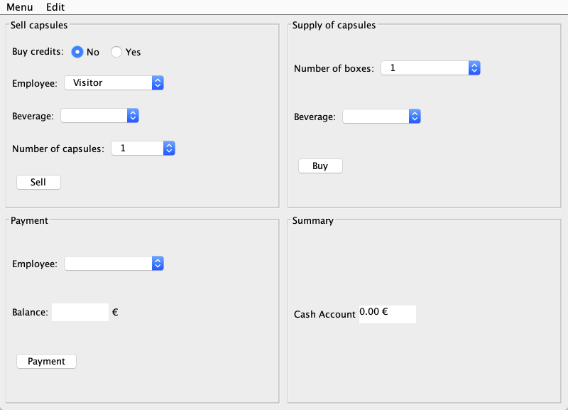

## Add a beverage
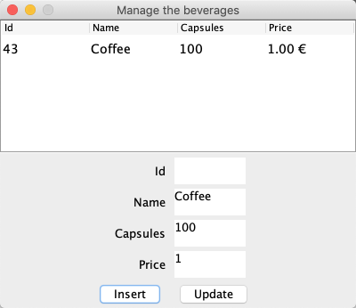

## Add an employee
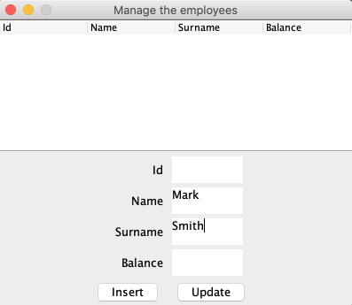

# Recharge an account
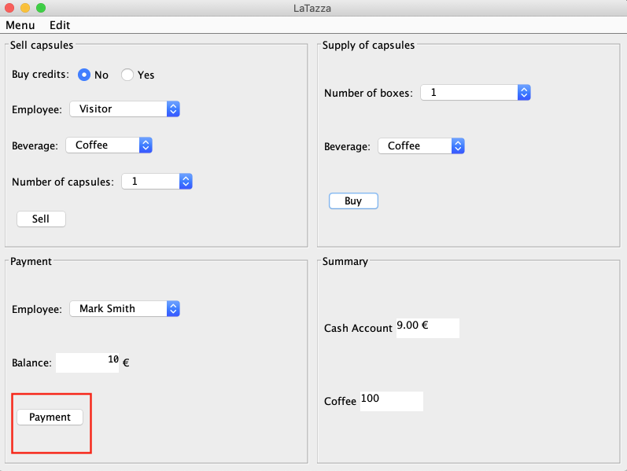
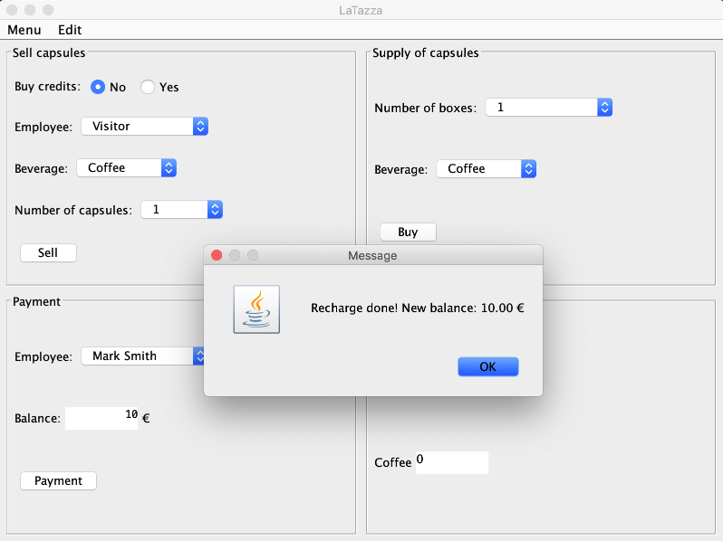

## Buy boxes of capsules
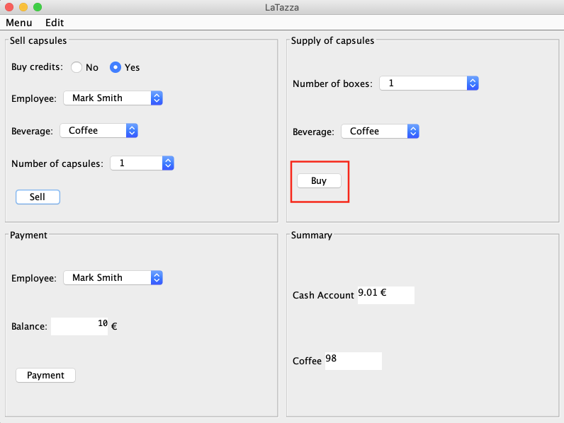
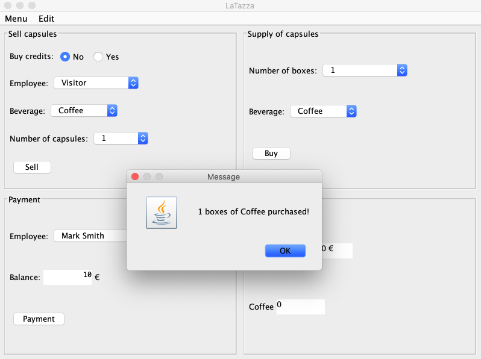

## Sell capsules to an employee

When in 'buy credits' NO is selected, it means that the Employee is paying using cash (his balance is not affected).

When in 'buy credits' YES is selected, it means that the Employee is using his/her account (his/her balance is affected).

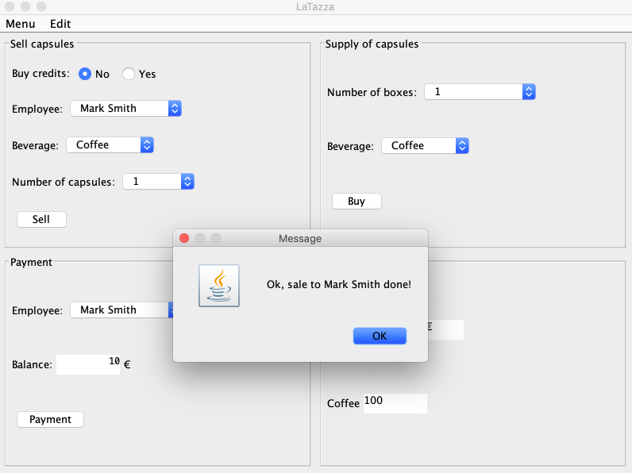

## Sell capsules to a visitor

When the manager is selling capsules to a visitor the 'buy credits' checkbox is not taken into account.

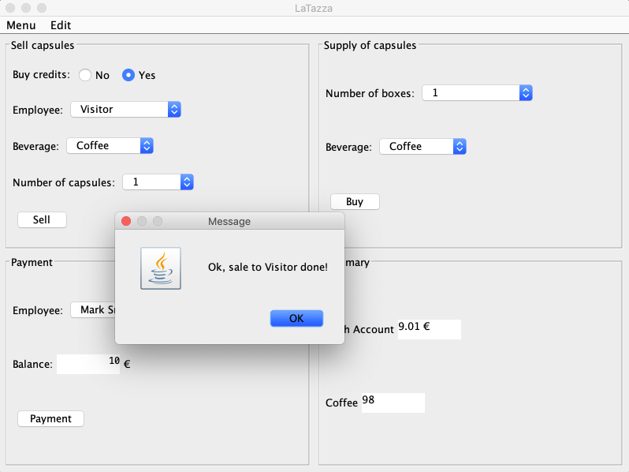

## View the logs
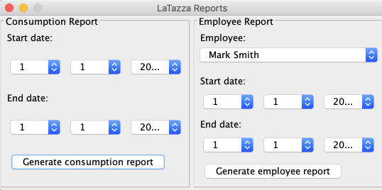

## Consumption Report
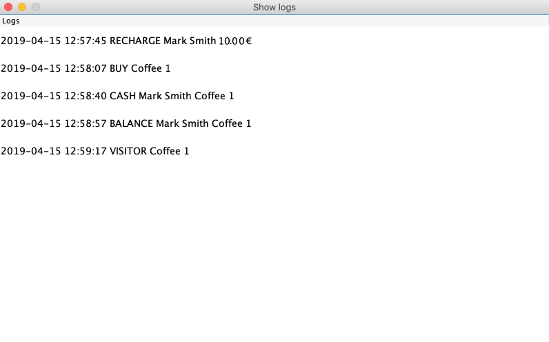

## Employee Report
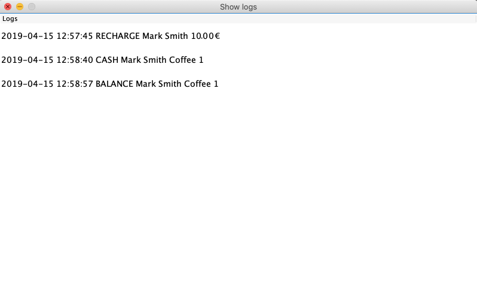
