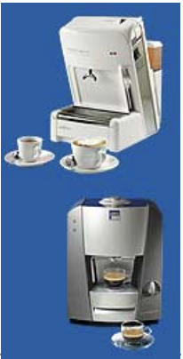
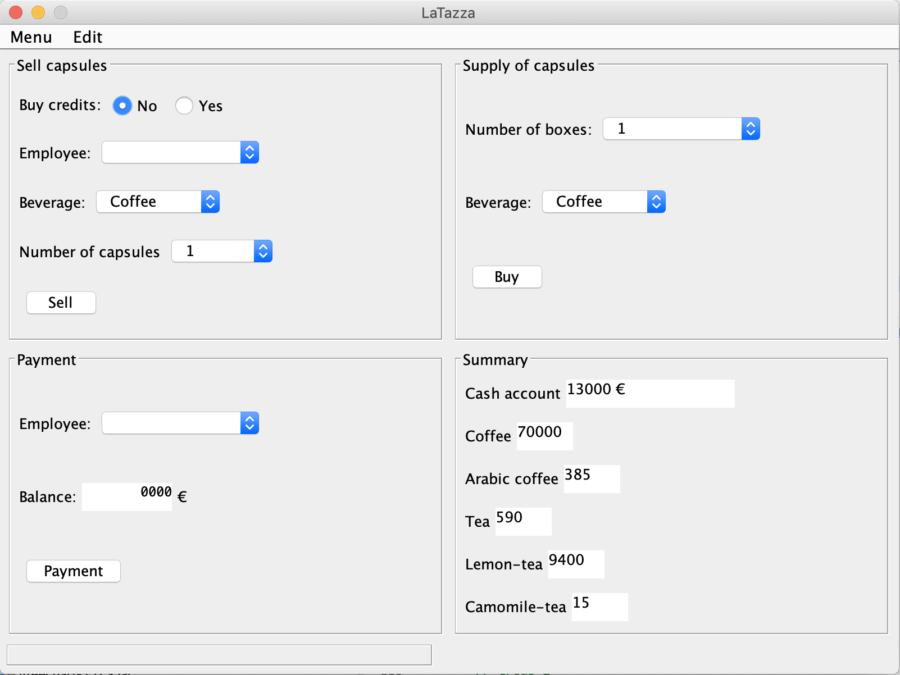

# La Tazza Informal Description

In many work environments employees like to have coffee and other beverages. So they buy and share a coffee maker that uses capsules (see Figure 1 ). For the sake of a friendly working environment the purchase and payment of capsules must be managed. One of the employees (the manager) takes charge of managing this, using LaTazza.

*Figure 1: Expresso coffee maker*

LaTazza is a desktop application that helps to manage the sale and the supply of capsules.
Capsules can be of several types (Coffee, Arabic coffee, Tea, Lemon-tea, Camomile-tea). Capsules
can be bought by visitors or employees. Employees can have a local account, so they can buy cash
or on their account, visitors only cash.
The manager can:

* sell capsules to clients
* buy boxes of capsules (a box contains 50 capsules of the same kind)
* manage credit and debt of the employees
* check the inventory (number of capsules per type)
* check the cash account.

The application could have a GUI similar to the one in Figure 2

*Figure 2: LaTazza Screenshot*
